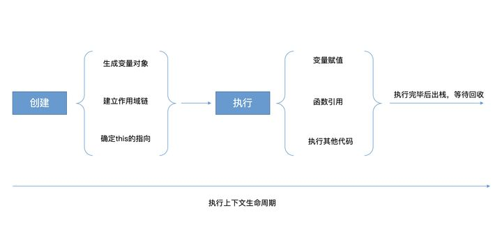
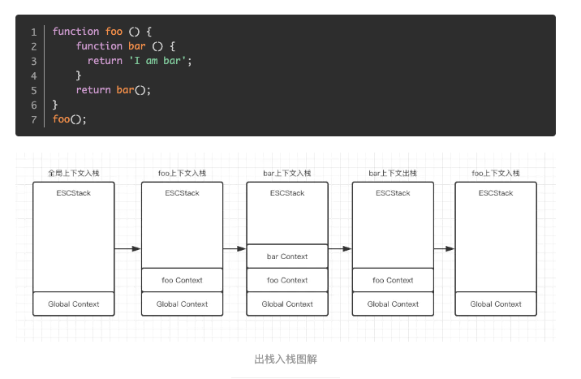

> 2022.05.30-2022.06.01

# 定义

## 1 作用域

在 JavaScript 中, 对象和函数同样也是变量。

**在 JavaScript 中, 作用域为可访问变量，对象，函数的集合。**

### 1.1分类

- 全局作用域：
  - 全局变量
  - 网页中所有的脚本和函数均可以使用，也就是所任意一个地方，无处不在

- 函数作用域：
  - 因为函数本身也是一个变量，所以也有自己的作用域
  - 函数内声明的变量叫局部变量，只能在函数内部使用
  - 不同的函数可以使用相同名称的变量。

- 块级作用域：只能在块中使用，访问

### 1.2全局变量和局部变量关系

- 如果有同名的局部变量和全局变量，局部变量将覆盖全局变量
- 如果变量在函数内没有声明（没有使用 var 关键字），该变量为全局变量。

eg:

```js
// 此处可调用 carName 变量
function myFunction() {
  carName = "Volvo";    // 此处可调用 carName 变量
}
```

### 1.3变量的声明周期

JavaScript 变量生命周期在它声明时初始化。

全局变量在页面关闭后销毁。

局部变量在函数执行完毕后销毁。

## 2 执行上下文

```js
ECObj = { // ------------------------------------------------- 执行上下文
    scopeChain: { ... }, // ---------------------------------- 作用域链
    variableObject: { // ------------------------------------- 变量对象
        arguments: {
            0: 22,
            length: 1
        },
        i: 22,
        c: pointer to function c()
        a: 'hello',
        b: pointer to function privateB()
    },
    this: { ... } // ----------------------------------------- this对象
}
```

> 变量对象与活动对象的概念是ES3提出的老概念，从ES5开始就用词法环境和变量环境替代,含义是一样的

- VO：变量对象 variable object

- AO：活动对象 active object
- 当进入到一个执行上下文后，这个变量对象才会被激活，所以叫活动对象(AO)，这时候活动对象上的各种属性才能被访问。
- EC：执行上下文 execution context
- ECS：执行上下文栈 execution context stack
- Scope Chain：作用域链

### 2.1 理解含义
函数执行前进行准备的工作（如确定作用域、创建局部变量、变量提升），就是执行上下文

=> **当一个函数调用执行时，该函数被压入函数调用栈，同时函数执行上下文将生成**

### 2.2 分类
> 执行环境  => 执行上下文

- 全局环境 => 全局执行上下文
- 函数环境 => 函数执行上下文
- eval函数环境（已不推荐使用，有注入风险） => eval函数执行上下文

### 2.3 生命周期

**而函数执行上下文的生命周期分为两个阶段，创建阶段和执行阶段**



- 创建阶段

  - 创建变量对象(arguments、形参、变量、函数)

    - 优先级：**函数形参 > 函数声明 > 变量声明**

    - 建立arguments对象: 检查当前上下文中的参数，建立该对象下的属性与属性值。

    - 函数形参赋值

      - Key: 形参的名字
      - Value：**实参的值**
      - 对于没有传递的参数，key就是形参名字，value是 undefined

    - 函数声明

      - key：函数名
      - value：指向堆中函数的指针
      - 函数名已经存在，新的引用覆盖以前的（函数名和已经存在的形参名相同，则覆盖形参）

    - 变量声明

      - key：变量名称
      - value：**undefined**
      - 如果变量名已经存在（如果变量名和已经声明的形参名，函数名相同的话，则会直接跳过变量声明，不会影响已经存在的属性）

    - ```js
      // 做题巩固一下
      // 第一题
      function a(name, age) {
          console.log(name); // dbh
          var name = 10;
          console.log(name); // 10
          console.log(age);  // 20
      }
      a('dbh', 20)
      // 解：看a这个函数内部
      function a(name, age) {
        	// 形参赋值为实参；变量初始赋值为undefined
        	var name = 'dbh'; var name = undefined;
        	// 如上同时具有：形参声明和变量声明，因为变量提升优先级：形参 > 变量； 此处为形参声明
        	var age = '20'; // 形参声明
          console.log(name);  // dbh
          name = 10; // 执行阶段变量重新赋值，所以下面打印name值是10
          console.log(name); // 10
          console.log(a ge); // 20
      
      }
      -----------------------------------------------------------------
      
      // 第二题
      function a(name) {
          console.log(name); // function name() {.....}
          var name = 10;
          function name() {
              console.log('20')
          };
      }
      a('dbh')
      // 解：看a这个函数内部
      function a(name) {
        	var name = 'dbh'; var name = function name() {...}; var name = undefined;
        	//如上 形参声明&&变量声明&&函数声明，因为变量提升，函数形参 > 函数声明 > 变量声明，所以此处是形参声明
        	console.log(name); // function name() {.....}
          var name = 10;
        	console.log(name); // 10
          function name() {
              console.log('20')
          };
          console.log(name); // 10
      
      }
      -----------------------------------------------------------------
      
      // 第三题
      function a(name) {
          var name = 10;
          function name() {
              console.log('20')
          };
          console.log(name); // 10
      }
      a('dbh')
      // 解：看a这个函数内部
      function a(name) {
       	 // 此处有几个声明 【3个】
        	var name = 'dbh'; // 形参声明，且值是实值
        	var nname = function name(){...}; // 函数声明，值是指针
        	var name = undefined; // 变量声明，值是undefined
        	// 按照变量声明优先级，哪个生效？ 【第一个，其他两个无效】
        	// 开始具体代码执行
        	name = 10;
          // 变量赋值，改变了原有值
          function name() {
              console.log('20')
          };
          // 函数已经声明，相当于移动到了上面；
          console.log(name); // 10
      }
      ```

      

  - 建立作用域链(scope chain)

    - **作用域链是一条变量对象的层级链，它和执行上下文有关，用于在处理标识符时候进行变量查询**
    - **作用域链就是内部上下文所有变量对象（包括父变量对象）的列表，此链用于变量查询**

    > Eg: 如果自身作用域中声明该变量，则无需使用作用域链;如果自身作用域中未声明该变量，则需要使用作用域链进行查找

    - ```js
      // 简单表示如下：
      activeExecutionContext = {
          VO: {...}, // 或者 AO
          this: thisValue,
          Scope: [ // 所用域链
            // 所有变量对象的列表
            // 用于标识符查询
          ]
      };
      Scope = AO + [[Scope]]
      ```

    > [深入作用域链](https://zhuanlan.zhihu.com/p/373558206)

  - 确定this指向

    - 官方名称：This Binding。

    - 五种this绑定

      - 默认绑定

        - 函数调用时无任何调用前缀的情景！

        - 在全局执行上下文中，this总是指向全局对象，例如浏览器环境下this指向window对象。

        - 在严格模式环境中，默认绑定的this指向undefined

        - ```js
          function fn() {
              console.log(this); //window
              console.log(this.name);
          };
          
          function fn1() {
              "use strict";
              console.log(this); //undefined
              console.log(this.name);
          };
          
          var name = 'dbh';
          
          fn(); 
          fn1() //TypeError: Cannot read property 'a' of undefined
          ```

      - 隐式绑定

        - 最简单的例子就是函数调用！

        - 在函数执行上下文中，this的值取决于函数的调用方式，如果被一个对象调用，那么this指向这个对象。

        - 如果函数调用前存在多个对象，this指向距离调用自己最近的对象

        - ```js
          function fn() {
              console.log(this.name);
          };
          let obj = {
              name: 'dbh1',
              func: fn,
          };
          let obj1 = {
              name: 'dbh2',
              o: obj
          };
          let obj2 = {
              o: obj
          };
          obj.fn(); //dbh1
          obj1.o.func(); //dbh1 ? 为什么?因为：如果函数调用前存在多个对象，this指向距离调用自己最近的对象
          obj2.o.func(); // undefined
          ```

        - 题外话：**作用域链与原型链的区别**

          - 当访问一个变量时，解释器会先在当前作用域查找标识符，如果没有找到就去父作用域找，作用域链顶端是全局对象window，如果window都没有这个变量则报错。
          - 当在对象上访问某属性时，首选i会查找当前对象，如果没有就顺着原型链往上找，原型链顶端是null，如果全程都没找到则返一个undefined，而不是报错。

        - **隐式丢失**：在特定情况下会存在隐式绑定丢失的问题，最常见的就是作为参数传递以及变量赋值，先看参数传递

        - ```js
          // 第一种
          var name = 'dbh';
          let obj = {
              name: 'dbh2',
              fn: function () {
                  console.log(this.name);
              }
          };
          
          function fn1(param) {
              param();
          };
          fn1(obj.fn);//dbh
          // 解：
          我们将 obj.fn 也就是一个函数传递进 fn1 中执行，这里只是单纯传递了一个函数而已，this并没有跟函数绑在一起，所以this丢失这里指向了window。
          
          // 第二种
          var name = 'dbh1';
          let obj = {
              name: 'dbh2',
              fn: function () {
                  console.log(this.name);
              }
          };
          let fn1 = obj.fn;
          fn1(); // dbh1
          // 解：第二个引起丢失的问题是变量赋值，其实本质上与传参相同
          ```

      - 显示绑定

        - 当我们调用一个函数时，我们习惯称之为函数调用，函数处于一个被动的状态；

        - 通过call、apply、bind改变了函数fn的this指向，让函数从被动变主动，函数能主动选择自己的上下文，所以这种写法我们又称之为函数应用。

        - 如果在使用call之类的方法改变this指向时，指向参数提供的是null或者undefined，那么 this 将指向全局对象。

        - ```js
          let obj1 = {
              name: 'dbh1'
          };
          let obj2 = {
              name: 'dbh2'
          };
          let obj3 = {
              name: 'dbh3'
          }
          var name = 'dbh';
          
          function fn() {
              console.log(this.name);
          };
          fn(); //dbh
          fn.call(obj1); //dbh1
          fn.apply(obj2); //dbh2
          fn.bind(obj3)(); //db3
          fn.call(undefined); //dbh 指向参数提供的是null或者undefined，那么 this 将指向全局对象
          fn.apply(null); //dbh 指向参数提供的是null或者undefined，那么 this 将指向全局对象
          fn.bind(undefined)(); //dbh 指向参数提供的是null或者undefined，那么 this 将指向全局对象
          
          // js内置显示绑定[菜鸟教程](https://m.runoob.com/jsref/jsref-foreach.html)
          // array.forEach(function(currentValue, index, arr), thisValue)
          // thisValue: 可选。传递给函数的值一般用 "this" 值。如果这个参数为空， "undefined" 会传递给 "this" 值
          let obj = {
              name: 'dbh1'
          };
          
          [1, 2, 3].forEach(function () {
              console.log(this.name);//dbh1*3
          }, obj)
          ```

        - 题外话

          - 1.call、apply与bind都用于改变this绑定，但call、apply在改变this指向的同时还会执行函数，而bind在改变this后是返回一个全新的boundFcuntion绑定函数，这也是为什么上方例子中bind后还加了一对括号 ()的原因。

          - 2.bind属于硬绑定，返回的 boundFunction 的 this 指向无法再次通过bind、apply或 call 修改；call与apply的绑定只适用当前调用，调用完就没了，下次要用还得再次绑。

          - 3.call与apply功能完全相同，唯一不同的是call方法传递函数调用形参是以散列形式，而apply方法的形参是一个数组。在传参的情况下，call的性能要高于apply，因为apply在执行时还要多一步解析数组。

          - 

          - ```js
            // 题外话2
            let obj1 = {
                name: 'dbh1'
            };
            let obj2 = {
                name: 'dbh2'
            };
            var name = 'dbh';
            
            function fn() {
                console.log(this.name);
            };
            fn.call(obj1); //dbh1
            fn(); //dbh 调用完就没了，下次要用还得再次绑。
            fn.apply(obj2); //dbh2
            fn(); //dbh 调用完就没了，下次要用还得再次绑。
            let boundFn = fn.bind(obj1);//dbh1
            boundFn.call(obj2);//dbh1 无法再次修改
            boundFn.apply(obj2);//dbh1 无法再次修改
            boundFn.bind(obj2)();//dbh1 无法再次修改
            
            // 题外话3
            let obj = {
                name: 'dbh1',
            };
            
            function fn(age,describe) {
                console.log(`我是${this.name},我的年龄是${age}，我非常${describe}!`);
            };
            fn.call(obj,'26','帅');//我是dbh1,我的年龄是26，我非常帅
            fn.apply(obj,['26','帅']);//我是dbh1,我的年龄是26，我非常帅
            ```

      - new绑定

        - 那么new一个函数究竟发生了什么呢，大致分为三步：

          - 1.以构造器的prototype属性为原型，创建新对象；
          - 2.将this(可以理解为上句创建的新对象)和调用参数传给构造器，执行
          - 3.如果构造器没有手动返回对象，则返回第一步创建的对象

        - ```js
          function Fn(){
              this.name = 'dbh';
          };
          let echo = new Fn();
          echo.name; // dbh
          ```

        - [实现一个简单的new方法](https://www.cnblogs.com/echolun/p/10903290.html)

      - 箭头函数绑定

        - 箭头函数没有this，箭头函数的this指向取决于外层作用域中的this，外层作用域或函数的this指向谁，箭头函数中的this便指向谁

        - 特点

          - 箭头函数没有自己的this，箭头函数中的this是箭头函数定义时所在的作用域中的上层作用域中的this

          - 因为没有this，所以不能作为构造函数，不能使用 new 命令

          - 没有 arguments 对象，可以使用 rest 参数代替

          - 不能使用 yield 命令，即不能作为generator函数

          -  箭头函数没有this，所以无法被再次修改。但是可以修改其上层作用域

          - ```js
            function fn() {
                return () => {
                    console.log(this.name);
                };
            }
            let obj1 = {
                name: 'dbh1'
            };
            let obj2 = {
                name: 'dbh2'
            };
            let bar = fn.call(obj1); // fn this指向obj1
            bar.call(obj2); // dbh1
            
            fn.call(obj1)(); // dbh1; fn this指向obj1,箭头函数this也指向obj1
            fn.call(obj2)(); // dbh2; fn this 指向obj2,箭头函数this也指向obj2
            ```

    - 优先级

      - 显式绑定 > 隐式绑定 > 默认绑定

      - new绑定 > 隐式绑定 > 默认绑定

      - ```js
        // 为什么显式绑定不和new绑定比较呢？因为不存在这种绑定同时生效的情景，如果同时写这两种代码会直接抛错，所以大家只用记住上面的规律即可。
        function Fn(){
            this.name = 'a';
        };
        let obj = {
            name:'b'
        }
        let echo = new Fn().call(obj);//报错 call is not a function
        
        // 显式>隐式
        let obj = {
            name:'dbh',
            fn:function () {
                console.log(this.name);
            }
        };
        obj1 = {
            name:'dbh2'
        };
        obj.fn.call(obj1);// dbh2
        
        //new>隐式
        obj = {
            name: 'dbh',
            fn: function () {
                this.name = 'dbh';
            }
        };
        let echo = new obj.fn();
        echo.name;// dbh1
        ```

- 执行阶段

  - 变量赋值
  - 函数引用
  - 执行其他代码

### 2.4 具体解释

- 全局执行上下文
  - 形成时机：全局代码执行前
  - 详细理解：
    - 在 ( 全局代码 ) 执行前，将 ( window ) 确定为 ( 全局执行上下文对象 ) 
    - 对 ( 全局数据 ) 进行 预处理
      - 变量提升，函数提升，并将全局变量和函数变量确定为window的属性
      - 将 this 指向 window

- 函数执行上下文
  - 形成时机：函数调用时，并且在 ( 执行函数体之前 )，( 创建 ) 函数执行上下文对象
    - 区别
    - 全局执行上下文 和 函数执行上下文 形成时机的区别
      - 全局执行上下文是把window确定为全局执行上下文，之前window就存在 ------ 之前就存在
      - 函数执行上下文在函数调用并且函数体执行前，新创建的函数执行上下文对象 --- 新创建
    - 详细
      - 在 ( 函数调用，并且函数体执行前 )，新 ( 创建 ) ( 函数执行上下文对象 )
      - 形参赋值为实参
      - 变量提升，函数名提升
      - arguments 对象赋值
      - this 赋值为该函数执行上下文对象

### 2.5 执行上下文的顺序

众所周知，JavaScript是单线程的，所以上下文执行的顺序是一个“入栈出栈”的过程。

原则：先进后出，后进先出



> 堆栈溢出: Uncaught RangeError: Maximum call stack size exceeded
>
> 虽然没有明确的数量限制，但如果超出栈分配的空间，会造成堆栈溢出。常见于递归调用，没有终止条件造成死循环的场景。

## 3 作用域和执行上下文的区别

- 形成时机
  - 函数作用域：是在函数创建时形成
  - 函数执行上下文：是在函数调用，并且函数体执行前新创建的
- 动态和静态
  - 函数作用域：是静态的，函数创建后就不会再变
  - 函数执行上下文：是动态的，函数调用函数体执行前创建，调用结束后释放
- 联系
  - ( 执行上下文对象 ) 是从属于所在的 ( 作用域 )
  - ( 全局执行上下文对象 ) 从属于 ( 全局作用域 )
  - ( 函数执行上下文对象 ) 从属于 ( 函数作用域 )
  - 因为只有函数存在，才会去创建函数执行上下文对象

## 4 一个特殊的概念：闭包

上面我们已经学过了变量的作用域，我们都知道：**函数内部可以直接读取全局变量，但是在函数外部无法读取函数内部的局部变量。**

我们有没有办法？从外部读取函数内部的局部变量呢？ 当然有！最简单的方式就是，函数内部再定一个函数

```js
function f1(){
    var n=999;
    function f2(){
        alert(n); // 999
    }
}
```

在上面的代码中，函数 f2 就被包括在函数 f1 内部，这时 f1 内部的所有局部变量，对 f2 都是可见的。但是反过来就不行，f2 内部的局部变量，对 f1 就是不可见的。

这就是 JavasSript 语言特有的"链式作用域"结构（chain scope），

子对象会一级一级地向上寻找所有父对象的变量。所以，父对象的所有变量，对子对象都是可见的，反之则不成立。

既然 f2 可以读取 f1 中的局部变量，那么只要把 f2 作为返回值，我们不就可以在 f1 外部读取它的内部变量了吗！

### 定义

 闭包就是能够读取其他函数内部变量的函数。

### 用途

- 1、可以读取函数内部的变量
- 2、让这些变量的值始终保持在内存中，不会在 f1 调用后被自动清除。

为什么会这样呢？原因就在于 f1 是 f2 的父函数，而 f2 被赋给了一个全局变量，这导致 f2 始终在内存中，而 f2 的存在依赖于 f1，因此 f1 也始终在内存中，不会在调用结束后，被垃圾回收机制（garbage collection）回收。

### 注意点

- 由于闭包会使得函数中的变量都被保存在内存中，内存消耗很大，所以不能滥用闭包，否则会造成网页的性能问题，在IE中可能导致内存泄露。解决方法是，在退出函数之前，将不使用的局部变量全部删除。
- （2）闭包会在父函数外部，改变父函数内部变量的值。所以，如果你把父函数当作对象（object）使用，把闭包当作它的公用方法（Public Method），把内部变量当作它的私有属性（private value），这时一定要小心，不要随便改变父函数内部变量的值。

```js
for(var i=0;i<5;i++){
    setTimeout(console.log('i',i), 300);        
}
// 0，1，2，3，4
-----------------------------------------------
for(var i=0;i<5;i++){
    setTimeout(() => console.log('i',i), 300);        
}
// 五个5
-----------------------------------------------
// for循环的时候，你并没有执行这个函数，你这个函数是过一秒才执行的，当执行这个函数的时候，它发现它自己没有这个变量i，于是向它的作用域链中查找这个变量i，因为这个时候已经for循环完了，所以储存在作用域链里面的i的值就是5，最后就打印出来5了。
-----------------------------------------------
for (let i = 0; i < 5; i++) {
  setTimeout(() => {
    console.log(i);
  }, 1000);
}
// 0，1，2，3，4
利用 let 变量的特性 — 在每一次 for 循环的过程中，let 声明的变量会在当前的块级作用域里面（for 循环的 body 体，也即两个花括号之间的内容区域）创建一个文法环境（Lexical Environment），该环境里面包括了当前 for 循环过程中的 i
-----------------------------------------------
for (var i = 0; i < 5; i++) {
   (function (i) {
     setTimeout(() => {
       console.log(i);
     }, 1000);
   })(i);
 }
// 0，1，2，3，4
// 利用函数自执行的方式，把当前 for 循环过程中的 i 传递进去，变量i保存到这个自执行函数构建出的块级作用域中，IIFE 其实并不属于闭包的范畴
-----------------------------------------------
for (var i = 0; i < 5; i++) {
  setTimeout(
    (i) => {
      console.log(i);
    },
    1000,
    i
  );
}
// 0，1，2，3，4
利用 setTimeout 函数的第三个参数，会作为回调函数的第一个参数传入
```


# 参考

[[深入01] 执行上下文 和 作用域](https://juejin.cn/post/6844904046050934792)

[五种js的this绑定详解](https://www.cnblogs.com/echolun/p/11962610.html)

[菜鸟教程-闭包](https://www.runoob.com/w3cnote/closure-intro.html)
